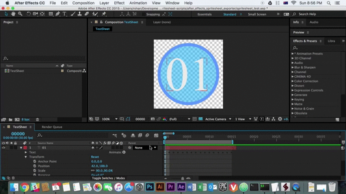

# Sprite Sheet from AE Composition

This script enables the user to export an After Effects composition to a sprite sheet with uniformly-sized cells. If the resultant spritesheet will be a square image, the user is also given the option of automatically resizing and saving the sprite sheet in multiple different common sizes/resolutions.

## Installation

1. Copy the contents of this directory to the following location:

* **Windows:** `<AFTER_EFFECTS_INSTALL_DIRECTORY>\Support Files\Scripts`
* **OSX:** `~/Applications/Adobe After Effects <VERSION>/Scripts`

## Usage

1. With a project open and your composition selected, run the script via the *File->Scripts* menu. For testing, a sample After Effects project called `spritesheet_test.aep` has been provided.

1. In the dialog box:

    1. Enter a name in the top section. This will be used as the filename prefix for your output files. For instance, if you enter `T_MySpriteSheet`, the output filename will be called `T_MySpriteSheet_2048.psd`, or similar.
    1. Enter the number of rows and columns you desire. This should add up to the number of frames in the work area to avoid extraneous or missing frames.
    1. Select the image sizes you wish to save.
    1. Click OK.

1. The exported sprite sheet images will be exported into the same directory as the After Effects project (ie. `<AFTEREFFECTS_PROJECT_DIR>\SpriteSheets\<SHEET_NAME>`).
